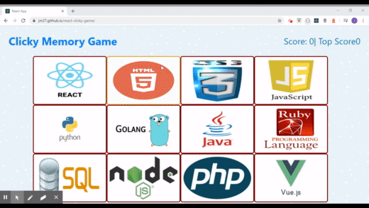

# Clicky-Game 

# Built with React

* A game of memory where you have to click different images of "Programming languages" without repeating the same image, you think you can win??

## Getting Started

[Clicky-Game DEPLOYED LINK](https://jm27.github.io/react-clicky-game/ "Homepage")
======

* Deployed using Github Pages.

## Built With

* HTML.
* CSS.
* BOOTSTRAP.
* JAVASCRIPT.
* REACT.
# Dependencies

 "gh-pages": "^2.2.0",
    "react": "^16.12.0",
    "react-dom": "^16.12.0",
    "react-scripts": "3.3.0"
* Gh-Pages.
* React-Dom.
* React-Scripts.

## Versioning
Clicky-Game V1.1

## Authors

* **Jesus Esquer** - *Main Contributor* - [jm27](https://github.com/jm27)

## Acknowledgments

* Thanks to Classmates, Instructors, and TA's 
* Bootcamp 2019-2020

